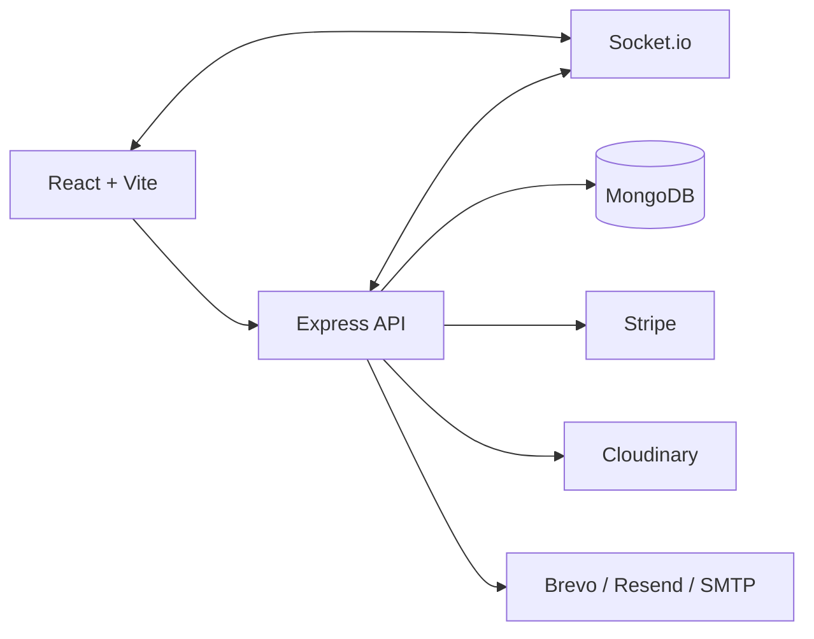

# RiZBiD

RiZBiD is a full-stack, real-time verified bidding platform.

Core business model:
- Sellers submit products to RiZBiD for office verification.
- Admin approves/disapproves listings before publishing.
- Bidders register during a registration window.
- Live bidding starts after registration closes.
- Winner pays.
- RiZBiD handles shipping (7-14 days).
- Winner confirms `Product Received` to close lifecycle.

---

## 1. Full Analysis Summary

### 1.1 Key Findings (Before This Update)
- Notification leakage: some live notifications were broadcast globally to all users.
- Payment UI race: winner could still see `Proceed to Payment` after successful payment if webhook sync lagged.
- Image reliability: cross-browser/profile image loading could fail without graceful fallback.
- Frontend startup load: large initial JS bundle due to eager page imports.
- Socket efficiency: auction detail page had suboptimal socket lifecycle.
- Marketing automation missing: no recurring monthly promotional campaign scheduler.
- Documentation drift: old escrow-focused and BidPulse-era docs were out of date.

### 1.2 Improvements Implemented
- Targeted notification delivery by user/admin socket rooms.
- Payment reconciliation fallback to sync paid state reliably.
- One-time payment safeguards and shipping-state transition.
- Robust image URL normalization + runtime fallback.
- Route-level lazy loading to reduce initial bundle.
- Cleaner socket connect/disconnect lifecycle in auction detail page.
- Recurring monthly promotional email campaign (Jan-Dec), 15th every month, repeats yearly.
- Dedupe/send-tracking for promotional emails via MongoDB log model.
- README fully updated to current RiZBiD architecture and flows.

---

## 2. Architecture



---

## 3. Auction Lifecycle (Current Logic)

1. Seller submits listing request.
2. Admin reviews and either:
   - Approves: listing moves to `future`.
   - Disapproves: seller receives reason.
3. Bidders register during configured registration window.
4. If 0 registrations:
   - Seller may withdraw (`$9.99`) or relist lower (`$14.99`).
5. If 1 registration:
   - Single bidder wins at starting price.
6. If >=2 registrations:
   - Live bidding starts with first two registrants.
   - 10-second turn cycle + give-up queue logic.
7. Winner pays.
8. RiZBiD handles shipping (7-14 days).
9. Winner confirms `Product Received`.
10. Auction closes (`closed`).

---

## 4. Payment and Shipping Flow

- `completed` -> winner can start checkout.
- On payment success -> `paid_shipping_pending`.
- Seller payout computed immediately (5% commission, 95% seller amount).
- Winner sees `Product Received` button.
- On confirm received -> `closed`.

### Payment Reliability Enhancements
- Duplicate checkout blocked if payment already completed.
- Active session lock prevents concurrent duplicate payment sessions.
- `confirm-success` endpoint validates Stripe session from success page.
- `reconcile` endpoint syncs status from stored Stripe session if webhook was delayed.

---

## 5. Notification Model (User-Specific)

Realtime notifications now route to:
- `user:<id>` room for user-targeted events.
- `role:admin` room for admin-targeted events.

No global broadcast for sensitive lifecycle events (payment, failure, approval, payout, receipt, etc.).

---

## 6. Monthly Promotional Email System

### Schedule
- Cron: every month on the **15th** at **10:00**.
- Repeats automatically every year.
- Timezone configurable with `PROMOTIONAL_EMAIL_TIMEZONE` (default `UTC`).

### Deduplication
- `PromotionalEmailLog` model stores `(user, year, month)` unique records.
- Prevents duplicate sends during restarts/retries.

### Audience
- Verified, non-banned users with a valid email.

### Campaign Subjects (12 Emails)
1. January Kickoff: Verified Deals to Start the Year
2. February Spotlight: Limited Future Bids Open
3. March Momentum: Upgrade Season Starts on RiZBiD
4. April Advantage: Smart Bidders Register Earlier
5. May Drop: New Verified Listings Released
6. June Mid-Year Deals: Bid with Confidence
7. July Priority Access: Best Upcoming Bids
8. August Insider List: Top Performing Categories
9. September Power Bids: Verified Listings Expanding
10. October Premium Cycle: High-Value Bidding Week
11. November Peak Season: Register for Priority Bids
12. December Year-End Event: Final Verified Deals

### New Files/Code
- `backend/models/PromotionalEmailLog.js`
- `backend/utils/emailTemplates.js` (12 campaign templates)
- `backend/server.js` (cron + startup catch-up)

### Manual Admin Trigger (Testing/Demo)
- Endpoint: `POST /api/admin/promotional/trigger`
- Body options:
  - `month` (1-12, optional; defaults to current month)
  - `year` (optional; defaults to current year)
  - `dryRun` (`true/false`, optional)
  - `forceSend` (`true/false`, optional; bypasses monthly dedupe)

Example:
```json
{
  "month": 2,
  "year": 2026,
  "dryRun": false,
  "forceSend": true
}
```

---

## 7. Performance Optimizations Applied

### Frontend
- Route-level lazy loading for page modules (`React.lazy` + `Suspense`).
- AuctionDetails socket lifecycle optimized (connect only when needed, proper teardown).
- Image helper fallback prevents broken-image rendering stalls.

### Backend
- Targeted socket emission reduces unnecessary event traffic.
- Promotional send dedupe prevents repeat work.

### Build Result Snapshot
- Initial chunk size reduced significantly by route splitting.
- Pages are now served as separate chunks for faster first load.

---

## 8. Core API Endpoints

### Auth
- `POST /api/auth/register`
- `POST /api/auth/login`
- `GET /api/auth/me`
- `PUT /api/auth/updatedetails`
- `POST /api/auth/send-verification-otp`
- `POST /api/auth/verify-email-otp`

### Auctions
- `GET /api/auctions`
- `GET /api/auctions/:id`
- `POST /api/auctions`
- `PUT /api/auctions/:id`
- `DELETE /api/auctions/:id`
- `POST /api/auctions/:id/register`
- `POST /api/auctions/:id/bid`
- `POST /api/auctions/:id/give-up`
- `POST /api/auctions/:id/no-registration-decision`

### Payment
- `POST /api/payment/checkout/:auctionId`
- `POST /api/payment/confirm-success`
- `POST /api/payment/reconcile/:auctionId`
- `POST /api/payment/confirm-received/:auctionId`
- `POST /api/webhook`

### Admin
- `GET /api/admin/stats`
- `GET /api/admin/users`
- `GET /api/admin/auctions`
- `PUT /api/admin/users/ban/:id`
- `DELETE /api/admin/users/:id`
- `DELETE /api/admin/auctions/:id`
- `POST /api/admin/promotional/trigger`

---

## 9. Environment Variables

### Backend
```env
NODE_ENV=production
PORT=5000
MONGO_URI=...
JWT_SECRET=...
JWT_EXPIRE=30d

CLIENT_URL=http://localhost:5173
CORS_ORIGIN=http://localhost:5173
CORS_ORIGINS=http://localhost:5173

ADMIN_EMAIL=...
ADMIN_PASS=...

STRIPE_SECRET_KEY=...
STRIPE_WEBHOOK_SECRET=...

CLOUDINARY_CLOUD_NAME=...
CLOUDINARY_API_KEY=...
CLOUDINARY_API_SECRET=...
CLOUDINARY_FOLDER=rizbid

# Promo campaign scheduler timezone
PROMOTIONAL_EMAIL_TIMEZONE=UTC

# Preferred mail provider
BREVO_API_KEY=...
BREVO_SENDER_EMAIL=...
BREVO_SENDER_NAME=RiZBiD
```

### Frontend
```env
VITE_API_URL=http://localhost:5000/api
VITE_SOCKET_URL=http://localhost:5000
```

---

## 10. Local Development

Backend:
```bash
cd backend
npm install
npm run dev
```

Frontend:
```bash
cd frontend
npm install
npm run dev
```

Build:
```bash
cd frontend
npm run build
```

---

## 11. Suggested Next Improvements

1. Add integration tests for payment/webhook/reconcile/receipt flow.
2. Add notification preference controls (user can mute promo or specific categories).
3. Add queue-based job processing (BullMQ) for high-volume email sends.
4. Add tracing/request IDs across API + websocket events.
5. Add Redis adapter for socket room scaling in multi-instance deployments.

---

## License
MIT
