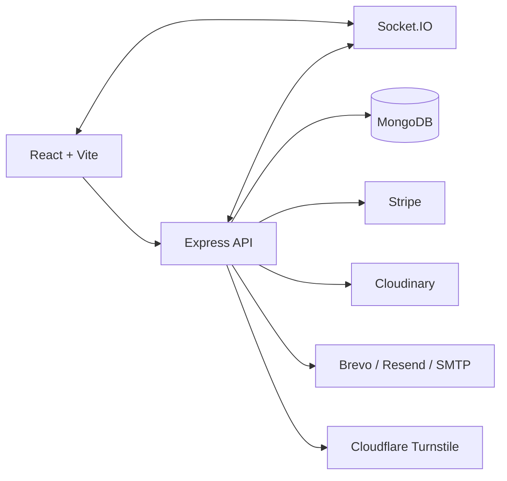

# AuctionPulse

AuctionPulse is a full-stack, real-time auction platform for verified buying and selling. Sellers submit listings, admins review them, participants register before the session opens, and winners complete payment while AuctionPulse manages the post-auction flow.

## Stack

- Frontend: React 19, Vite, Redux Toolkit, React Router, Socket.IO client
- Backend: Express 5, MongoDB with Mongoose, Socket.IO
- Payments: Stripe
- Media: Cloudinary
- Email: Brevo, Resend, or SMTP fallback
- Bot protection: Cloudflare Turnstile

## Core Flow

1. A user signs up with name, email, password, and Turnstile verification.
2. The new account is created but is not logged in automatically.
3. The user signs in through the regular login page.
4. After login, regular users are taken to the profile page.
5. The user completes profile verification with identity details and a profile picture.
6. Verification is finalized through either OTP or an email link sent to the user's primary email.
7. Only verified users can register for auctions, place offers, or create listings.
8. Sellers submit listings, admins approve or reject them, and approved listings move into the future auction pipeline.
9. Participants register before the registration window closes, then the live auction begins.
10. The winner pays, AuctionPulse manages shipping, and the winner confirms product receipt to close the lifecycle.

## Current Product Highlights

- User-specific notification system with bell popover and full notifications page
- Separate admin login page removed; admin credentials work through the regular login page
- Turnstile protection on sign up, login, and create-auction flows
- Profile verification moved out of sign-up and into the profile page after login
- Profile verification supports:
  - Date of birth with 18+ enforcement
  - Country
  - Primary contact
  - Optional emergency contact
  - NID or passport number
  - Profile picture upload
  - OTP or verification-link completion
- Dynamic social profile links in account editing
- Payment reconciliation helpers to reduce Stripe/webhook race issues
- Automated promotional and birthday email system

## Architecture



## Auction Lifecycle

1. Seller creates a listing request.
2. Admin reviews the request.
3. If approved, the listing becomes a future auction.
4. Participants register during the registration window.
5. If no one registers, the seller can withdraw or relist lower.
6. If one participant registers, that participant can win at the configured starting logic.
7. If multiple participants register, a live turn-based auction session begins.
8. The winner completes Stripe checkout.
9. AuctionPulse moves the order into shipping.
10. The winner confirms receipt and the auction closes.

## Authentication And Verification

- `POST /api/auth/register`
  - Creates a new account
  - Requires Turnstile
  - Does not auto-login
- `POST /api/auth/login`
  - Handles both normal users and admin credentials
  - Requires Turnstile
- `POST /api/auth/profile-verification/start`
  - Starts profile verification
  - Accepts OTP or link method
  - Uploads the profile picture as part of the flow
- `POST /api/auth/profile-verification/verify-otp`
  - Completes verification with OTP
- `GET /api/auth/profile-verification/verify-link/:token`
  - Completes verification with email link

Legacy email-verification-at-signup endpoints still exist in the router, but they now return `410` and are no longer part of the intended flow.

## Notifications

- Bell icon opens a popover instead of redirecting immediately
- Popover shows up to 10 notifications
- Unread notifications are shown first in the bell popover
- The full notifications page shows all notifications strictly by time and date
- Notifications are scoped to the signed-in user and no longer leak across accounts on the same device

Realtime delivery uses Socket.IO rooms such as:

- `user:<id>`
- `role:admin`

## Email System

AuctionPulse uses a shared email service and template layer:

- `backend/utils/emailService.js`
- `backend/utils/emailTemplates.js`

Delivery priority:

1. Brevo
2. Resend
3. SMTP via Nodemailer

### Transactional Emails

- Profile verification OTP
- Profile verification link
- Profile verified confirmation
- Password reset
- Support ticket creation and status updates
- Listing submitted, approved, disapproved
- Auction winner and participant outcome updates
- Payment receipt
- Shipping started
- Seller payout updates
- Funds released
- Payment failed
- Product received confirmation

### Promotional Emails

- Sent on the `5th` and `25th` of every month
- The same month's campaign is used for both sends
- Sent to all users with an email address
  - verified
  - unverified
  - banned
  - active
- Tracked by `PromotionalEmailLog`
- Manual trigger endpoint:
  - `POST /api/admin/promotional/trigger`
  - accepts `month`, `year`, `dayOfMonth`, `dryRun`, and `forceSend`

### Birthday Emails

- Sent daily to verified users whose date of birth matches the current day
- Tracked by `BirthdayEmailLog`
- Sent once per user per year

## Important Models

- `User`
- `Auction`
- `SupportTicket`
- `PromotionalEmailLog`
- `BirthdayEmailLog`

## Main API Areas

### Auth

- `POST /api/auth/register`
- `POST /api/auth/login`
- `GET /api/auth/me`
- `GET /api/auth/activity`
- `PUT /api/auth/updatedetails`
- `DELETE /api/auth/deleteaccount`
- `POST /api/auth/avatar/upload`
- `POST /api/auth/profile-verification/start`
- `POST /api/auth/profile-verification/verify-otp`
- `GET /api/auth/profile-verification/verify-link/:token`
- `GET /api/auth/export-data`
- `POST /api/auth/forgotpassword`
- `PUT /api/auth/resetpassword/:resetToken`

### Auctions

- `GET /api/auctions`
- `GET /api/auctions/summary/stats`
- `GET /api/auctions/:id`
- `POST /api/auctions`
- `PUT /api/auctions/:id`
- `DELETE /api/auctions/:id`
- `POST /api/auctions/:id/register`
- `POST /api/auctions/:id/bid`
- `POST /api/auctions/:id/give-up`
- `POST /api/auctions/:id/no-registration-decision`

### Payments

- `POST /api/payment/checkout/:auctionId`
- `POST /api/payment/create-checkout-session/:auctionId`
- `POST /api/payment/confirm-success`
- `POST /api/payment/reconcile/:auctionId`
- `POST /api/payment/confirm-received/:auctionId`
- `POST /api/payment/release/:auctionId`
- `POST /api/webhook`

### Admin

- `GET /api/admin/stats`
- `GET /api/admin/users`
- `GET /api/admin/users/:id/history`
- `PUT /api/admin/users/ban/:id`
- `DELETE /api/admin/users/:id`
- `GET /api/admin/auctions`
- `DELETE /api/admin/auctions/:id`
- `PUT /api/admin/auctions/:id/approve`
- `PUT /api/admin/auctions/:id/disapprove`
- `POST /api/admin/test-email`
- `POST /api/admin/promotional/trigger`

### Support

- `POST /api/support/tickets`
- `GET /api/support/tickets`
- `PUT /api/support/tickets/:id`

## Environment Variables

### Backend

```env
NODE_ENV=development
PORT=5000

MONGO_URI=...
MONGO_MAX_POOL_SIZE=20
MONGO_SERVER_SELECTION_TIMEOUT_MS=10000
MONGO_SOCKET_TIMEOUT_MS=45000

JWT_SECRET=...
JWT_EXPIRE=30d

CLIENT_URL=http://localhost:5173
CLIENT_APP_URL=http://localhost:5173
CORS_ORIGIN=http://localhost:5173
CORS_ORIGINS=http://localhost:5173

ADMIN_EMAIL=...
ADMIN_PASS=...
SUPPORT_EMAIL=...

TURNSTILE_SECRET_KEY=...

STRIPE_SECRET_KEY=...
STRIPE_WEBHOOK_SECRET=...

CLOUDINARY_CLOUD_NAME=...
CLOUDINARY_API_KEY=...
CLOUDINARY_API_SECRET=...
CLOUDINARY_FOLDER=AuctionPulse

PROMOTIONAL_EMAIL_TIMEZONE=UTC

BREVO_API_KEY=...
BREVO_SENDER_EMAIL=...
BREVO_SENDER_NAME=AuctionPulse Support
BREVO_API_URL=https://api.brevo.com/v3/smtp/email
BREVO_TIMEOUT_MS=15000

RESEND_API_KEY=...
RESEND_FROM_EMAIL=...
RESEND_API_URL=https://api.resend.com/emails
RESEND_TIMEOUT_MS=15000

SMTP_HOST=...
SMTP_PORT=587
SMTP_SECURE=false
SMTP_FAMILY=4
SMTP_CONNECTION_TIMEOUT_MS=10000
SMTP_GREETING_TIMEOUT_MS=10000
SMTP_SOCKET_TIMEOUT_MS=15000

EMAIL_SERVICE=gmail
EMAIL_USERNAME=...
EMAIL_PASSWORD=...
EMAIL_USER=...
EMAIL_PASS=...
```

### Frontend

```env
VITE_API_URL=http://localhost:5000/api
VITE_SOCKET_URL=http://localhost:5000
VITE_TURNSTILE_SITE_KEY=...
```

## Local Development

### Backend

```bash
cd backend
npm install
npm run dev
```

### Frontend

```bash
cd frontend
npm install
npm run dev
```

### Production Frontend Build

```bash
cd frontend
npm run build
```

## Notes

- If your MongoDB already has the older unique index for promotional emails on `(user, year, month)`, it should be replaced with the new `(user, year, month, dayOfMonth)` index so the 5th and 25th sends can coexist correctly.
- Socket connections are used for realtime auction and notification updates.
- The project currently has no dedicated automated test suite configured in `package.json`.

## License

MIT
