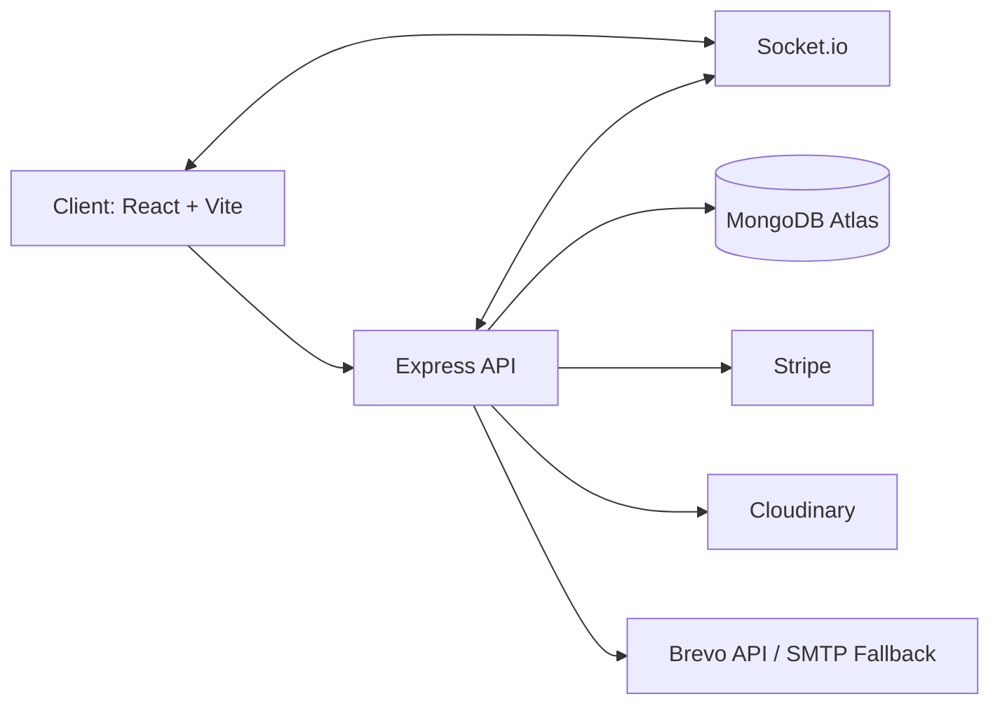
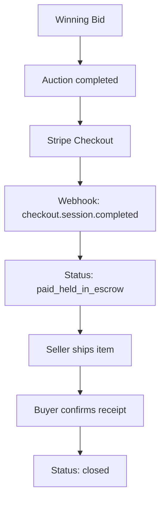

# BidPulse

BidPulse is a full-stack real-time auction platform built to demonstrate production-style engineering with strong trust controls: verified users, escrow-based payment flow, anti-sniping auction mechanics, and operations tooling for admin moderation and support.

Live deployments:
- Frontend (Vercel): `https://bid-pulse.vercel.app`
- Backend API (Render): `https://bidpulse-qkd9.onrender.com`

## Table of Contents
1. Project Vision
2. Product Scope
3. Development Story
4. Architecture
5. Backend Design
6. Frontend Design
7. Data Model
8. API Reference
9. Realtime Events
10. Authentication and Session Strategy
11. Email Delivery Strategy
12. Payments and Escrow Flow
13. Dashboards and Role UX
14. Media Upload Strategy
15. Error Handling and Reliability
16. Environment Variables
17. Local Development
18. Deployment Playbook
19. Troubleshooting Guide
20. Performance and Security Notes
21. Testing and Verification Checklist
22. Project Structure
23. Known Gaps
24. Roadmap
25. License
26. Full Audit and Upgrade Log (Latest)

## 1. Project Vision
Online auctions often fail in three ways:
- Low trust in transaction settlement.
- Last-second bid sniping that feels unfair.
- Weak operations and support tooling.

BidPulse addresses these by combining:
- Email-verified participation.
- Escrow payment lifecycle.
- Real-time bidding updates.
- Admin-level moderation and support workflows.

## 2. Product Scope

### Buyer capabilities
- Browse auctions.
- Place live bids.
- Complete checkout via Stripe.
- Hold funds in escrow until delivery confirmation.
- Release funds after confirming receipt.

### Seller capabilities
- Create and manage listings.
- Upload up to 3 images per auction.
- Track listing performance and payment states.
- Access buyer shipping details once payment is secured.

### Admin capabilities
- Monitor platform KPIs.
- Ban/unban/delete users.
- Moderate auctions globally.
- Run support ticket triage and live chat.
- Trigger mail health checks.

## 3. Development Story
BidPulse evolved in phases:

### Phase A: Core marketplace
- Built basic auth, auction listing, and bidding flows.
- Added seller and bidder role segmentation.

### Phase B: Realtime and trust
- Integrated Socket.io for bid updates and support chat.
- Added OTP verification and restricted actions for unverified users.

### Phase C: Commerce integrity
- Integrated Stripe checkout.
- Added escrow-style release flow and webhook updates.

### Phase D: Operations maturity
- Added admin dashboards and moderation endpoints.
- Added support desk and ticket lifecycle.

### Phase E: Production hardening
- Added request-level error normalization.
- Added backend 404/error middleware.
- Added session invalidation handling for deleted users.
- Added SPA rewrite rules for Vercel deep-link refresh.

### Phase F: Email stabilization
- Migrated from SMTP-only assumptions to HTTP provider support.
- Added Brevo API support for Render free-tier compatibility.
- Added transport verification, timeouts, and provider fallback behavior.

### Phase G: UX refinement
- Reworked profile and registration location strategy (country-only).
- Added address management.
- Upgraded dashboards with role-specific visual identity.
- Replaced image URL fields with real image uploads for auctions.
- Unified brand logo across global navigation and footer.

## 4. Architecture



High-level split:
- `frontend/`: React application with Redux Toolkit, route protection, and domain pages.
- `backend/`: Express API with modular controllers/routes/middleware.

## 5. Backend Design

### Main modules
- `controllers/`: auth, auction, payment, support, admin logic.
- `routes/`: route composition per domain.
- `models/`: Mongoose schemas.
- `middleware/`: auth guards and upload handling.
- `utils/`: email templates and delivery service.
- `config/`: DB and Cloudinary setup.

### Key backend characteristics
- Lean DB reads and indexed paths for admin scale.
- Cron job for auction expiration and outcome transitions.
- Non-blocking secondary email sends where latency sensitive.
- Explicit upload constraints (`max 3` auction images, size guardrails).

## 6. Frontend Design

### Stack
- React (Vite)
- Redux Toolkit
- Axios with centralized interceptors
- Tailwind CSS
- Socket.io client
- React Router
- React Toastify

### Patterns
- Protected route wrappers (`PrivateRoute`, `AdminRoute`).
- Centralized API client with token injection and auth-expiry signaling.
- Role-based dashboard layout and mode switching.

## 7. Data Model

### Core entities
- `User`
- `Auction`
- `SupportTicket`
- `Order` (payment state integration path)

### User highlights
- Verification fields (`emailVerified`, OTP hash + expiry).
- Profile identity (`location`, `address`, social links, avatar URL).
- Moderation fields (`isBanned`).

### Auction highlights
- Bid list (bidder, amount, timestamp).
- Lifecycle states:
  - `active`
  - `completed`
  - `unsold`
  - `paid_held_in_escrow`
  - `closed`
- Shipping details captured on checkout.
- Multiple image URLs (Cloudinary-hosted).

## 8. API Reference

### Auth
- `POST /api/auth/register`
- `POST /api/auth/login`
- `GET /api/auth/me`
- `PUT /api/auth/updatedetails`
- `POST /api/auth/send-verification-otp`
- `POST /api/auth/verify-email-otp`
- `POST /api/auth/avatar/upload`
- `DELETE /api/auth/deleteaccount`
- `POST /api/auth/forgotpassword`
- `PUT /api/auth/resetpassword/:resetToken`

### Auction
- `GET /api/auctions`
- `GET /api/auctions/:id`
- `POST /api/auctions` (multipart, images up to 3)
- `PUT /api/auctions/:id` (multipart, optional image replacement)
- `DELETE /api/auctions/:id`
- `POST /api/auctions/:id/bid`

### Payment
- `POST /api/payment/checkout/:auctionId`
- `POST /api/payment/release/:auctionId`
- `POST /api/webhook`

### Admin
- `GET /api/admin/stats`
- `GET /api/admin/users`
- `PUT /api/admin/users/ban/:id`
- `DELETE /api/admin/users/:id`
- `GET /api/admin/users/:id/history`
- `GET /api/admin/auctions`
- `DELETE /api/admin/auctions/:id`
- `POST /api/admin/test-email`

### Support
- `POST /api/support/tickets`
- `GET /api/support/tickets`
- `PUT /api/support/tickets/:id`

## 9. Realtime Events

### Auction channel
- Client joins `joinAuction` room.
- Server emits `bidUpdated`.
- Server emits `auction_ended`.

### Support channel
- `support:join`
- `support:message`
- `support:system`

## 10. Authentication and Session Strategy

### Token model
- JWT issued at login/register.
- Token carried in Authorization header.

### Frontend session behavior
- Axios interceptor injects token automatically.
- Auth-expiry custom event is dispatched only for real auth failures.
- Visibility-based session recheck is throttled to avoid aggressive refresh churn.
- Forced hard page reload was removed to keep UX stable.

## 11. Email Delivery Strategy

### Provider order
1. Brevo API (`BREVO_API_KEY`) over HTTPS.
2. Resend API (`RESEND_API_KEY`) if configured.
3. SMTP fallback (Nodemailer) when provider API keys are absent.

### Why this exists
- Render free tier may block outbound SMTP ports.
- HTTP API delivery (`443`) remains reliable in constrained hosting environments.

### Verification behavior
- Transport verification runs at startup.
- OTP send endpoints surface actionable failures instead of silent false-success.

## 12. Payments and Escrow Flow



## 13. Dashboards and Role UX

### Bidder dashboard
- Dark operational theme for active-market context.
- Focus on wins, active bids, and release actions.

### Seller dashboard
- Light operational theme for inventory/finance clarity.
- Focus on earnings, escrow, listing management, shipping details.

### Mode switching
- Path-aware with persisted preference (`localStorage`).
- Prevents inconsistent toggling behavior.

## 14. Media Upload Strategy

### Avatar uploads
- Single image, in-memory upload, Cloudinary transformation.

### Auction uploads
- Up to 3 images per listing.
- File type validation and size constraints.
- Cloudinary hosted URLs stored in auction documents.

## 15. Error Handling and Reliability

### Backend
- JSON 404 for unknown `/api` routes.
- Centralized error middleware.
- Route-level upload error mapping (file size/count/type).

### Frontend
- Unified error message normalization.
- Connectivity-aware toasts (online/offline).
- Graceful auth-expiry handling without hard reload loops.

### Production routing
- `frontend/vercel.json` rewrite ensures SPA deep links refresh correctly.

## 16. Environment Variables

### Backend (`backend/.env`)
```env
NODE_ENV=production
PORT=5000

MONGO_URI=...
JWT_SECRET=...
JWT_EXPIRE=30d

CLIENT_URL=https://bid-pulse.vercel.app
CORS_ORIGIN=https://bid-pulse.vercel.app
CORS_ORIGINS=https://bid-pulse.vercel.app

ADMIN_EMAIL=...
ADMIN_PASS=...
SUPPORT_EMAIL=...

STRIPE_SECRET_KEY=...
STRIPE_WEBHOOK_SECRET=...

CLOUDINARY_CLOUD_NAME=...
CLOUDINARY_API_KEY=...
CLOUDINARY_API_SECRET=...
CLOUDINARY_FOLDER=bidpulse

# Primary mail provider (recommended for Render free tier)
BREVO_API_KEY=...
BREVO_SENDER_EMAIL=...
BREVO_SENDER_NAME=BidPulse
BREVO_TIMEOUT_MS=15000

# Optional secondary mail provider
RESEND_API_KEY=
RESEND_FROM_EMAIL=
RESEND_TIMEOUT_MS=15000

# Optional SMTP fallback
EMAIL_SERVICE=gmail
EMAIL_USERNAME=
EMAIL_PASSWORD=
SMTP_HOST=
SMTP_PORT=587
SMTP_SECURE=false
SMTP_CONNECTION_TIMEOUT_MS=10000
SMTP_GREETING_TIMEOUT_MS=10000
SMTP_SOCKET_TIMEOUT_MS=15000
```

### Frontend (`frontend/.env`)
```env
VITE_API_URL=https://bidpulse-qkd9.onrender.com/api
VITE_SOCKET_URL=https://bidpulse-qkd9.onrender.com
```

## 17. Local Development

```bash
# backend
cd backend
npm install
npm run dev
```

```bash
# frontend
cd frontend
npm install
npm run dev
```

Build frontend:
```bash
cd frontend
npm run build
```

## 18. Deployment Playbook

### Frontend (Vercel)
- Configure `VITE_API_URL` and `VITE_SOCKET_URL`.
- Keep SPA rewrite config (`frontend/vercel.json`).

### Backend (Render)
- Set all required env vars.
- Ensure Cloudinary and payment keys are present.
- Prefer Brevo API for reliable mail on free tier.

## 19. Troubleshooting Guide

### Symptom: OTP says sent but no email arrives
- Check provider logs first (Brevo events).
- Verify sender email and daily limits.
- Hit admin test-email endpoint.

### Symptom: `Connection timeout` during SMTP
- Expected on Render free tier for SMTP ports.
- Use Brevo API path.

### Symptom: route refresh gives Vercel `NOT_FOUND`
- Ensure rewrite config exists in deployed frontend.

### Symptom: user sees forced login after tab switch
- Caused by over-aggressive auth invalidation.
- Fixed by throttled session checks + stricter auth-failure detection.

### Symptom: image upload fails
- Validate Cloudinary env vars.
- Ensure max file size and count constraints are respected.

## 20. Performance and Security Notes

### Performance
- Indexed models for common query paths.
- Lean query patterns in read-heavy endpoints.
- Cached/throttled fetch patterns in frontend slices.

### Security
- JWT route protection and role authorization.
- Banned-user checks at login.
- Reduced sensitive error leakage in API responses.
- Secret management expected via deployment environment variables.

## 21. Testing and Verification Checklist

### Auth
- Register, login, logout.
- OTP send/verify.
- Account deletion and stale-session handling.

### Auction
- Create with 1 image, 3 images, invalid file types, oversized files.
- Edit listing with and without image replacement.
- Bid updates via realtime events.

### Payment
- Checkout success webhook.
- Escrow hold and release.

### Admin
- User moderation actions.
- Auction moderation.
- Test email endpoint.

### Support
- Ticket creation + status transition.
- Live chat event propagation.

## 22. Project Structure
```text
BidPulse/
  backend/
    config/
    controllers/
    middleware/
    models/
    routes/
    utils/
    server.js
  frontend/
    public/
    src/
      components/
      pages/
      redux/
      utils/
    index.html
  README.md
```

## 23. Known Gaps
- No automated unit/integration test suite yet.
- Redux slices still carry some legacy code paths (e.g., retired emoji avatar thunk).
- Bundle size warning remains for frontend chunk split.

## 24. Roadmap
- Add automated tests (API + component + E2E smoke tests).
- Add queue-backed email retries and observability.
- Add audit logs for moderation actions.
- Add searchable support transcripts.
- Add push notifications for outbid/payment milestones.

## 25. License
MIT

## 26. Full Audit and Upgrade Log (Latest)

### 26.1 Audit Findings
The latest full-project pass identified these high-priority gaps:
- Legacy emoji-avatar backend/frontend code still present after UI removal.
- Duplicate email index warning from Mongoose schema definition.
- No API health/readiness endpoints for deployment monitoring.
- No graceful shutdown path for process restarts.
- No basic abuse control on high-risk auth/OTP/password endpoints.
- Frontend lint command was broken due missing ESLint flat config.
- Session refresh behavior previously over-aggressive on visibility changes and some API failures.

### 26.2 What Was Implemented

#### A. Session and refresh stabilization (frontend)
- Auth invalidation only on stronger token/session failure signals.
- Visibility-triggered `/auth/me` checks throttled to reduce frequent refresh behavior.
- Removed hard redirect reload behavior on auth-expired event.

Files:
- `frontend/src/App.jsx`
- `frontend/src/utils/axiosConfig.js`
- `frontend/src/redux/authSlice.js`

#### B. Legacy cleanup
- Removed emoji-avatar API endpoint and thunk remnants.
- Kept avatar upload as the profile image strategy.

Files:
- `backend/controllers/authController.js`
- `backend/routes/authRoutes.js`
- `frontend/src/redux/authSlice.js`

#### C. Backend operational hardening
- Added in-memory rate limiter middleware and applied to:
  - register/login
  - send/verify OTP
  - forgot/reset password
- Added:
  - `GET /api/health`
  - `GET /api/ready`
- Added graceful shutdown handlers for `SIGINT`/`SIGTERM` with DB close.

Files:
- `backend/middleware/rateLimitMiddleware.js`
- `backend/routes/authRoutes.js`
- `backend/server.js`

#### D. Database/model cleanup
- Removed duplicate schema index declaration to avoid startup warnings.

File:
- `backend/models/User.js`

#### E. Logging cleanup
- Removed noisy debug log formatting and normalized Stripe error logging.

File:
- `backend/controllers/paymentController.js`

#### F. Tooling improvement
- Added ESLint v9 flat config so `npm run lint` works consistently.
- Current lint status: runs successfully with warnings (no errors).

File:
- `frontend/eslint.config.js`

### 26.3 Validation Results
- Backend syntax checks passed on updated files.
- Frontend production build passed.
- Frontend lint runs successfully (warnings remain; no blocking errors).

### 26.4 Remaining Roadmap (Prioritized)

#### Priority 1 (next iteration)
- Introduce structured server logger (request ID + JSON logs).
- Add centralized validation layer (Joi/Zod/express-validator) for all mutable routes.
- Add backend integration tests for auth, auctions, payment release flow.

#### Priority 2
- Add refresh token strategy (short-lived access token + rotating refresh token).
- Add optimistic UI rollback patterns for high-frequency bidding interactions.
- Add stronger server-side anti-bid-spam controls per auction/user pair.

#### Priority 3
- Split large frontend bundle via route-level lazy loading.
- Add Sentry/monitoring integration for backend and frontend.
- Add full admin audit trail and exportable activity logs.

### 26.5 Scope Note
The phrase “implement everything” is practically unbounded for a living system.  
This pass executed the highest-impact stability, security, operability, and maintainability upgrades that could be completed safely in one cycle without disrupting existing feature behavior.
