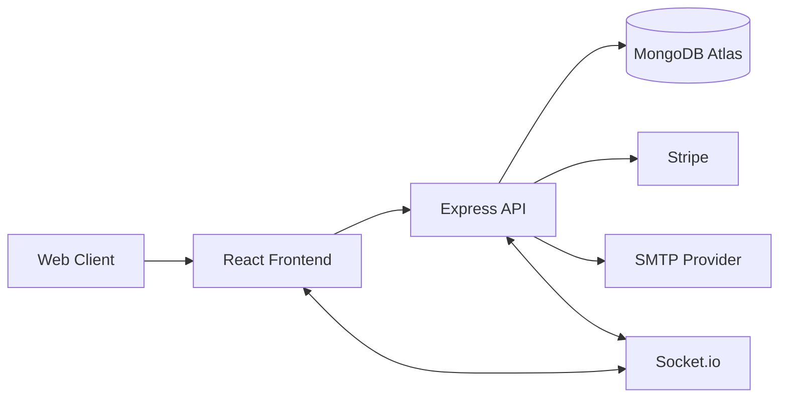
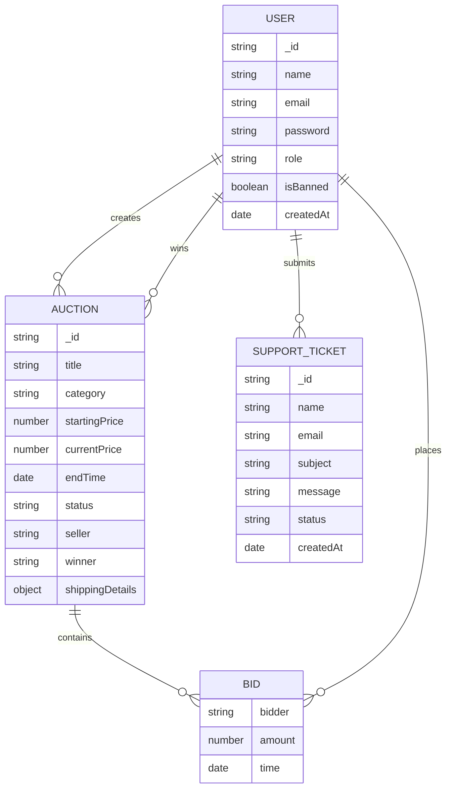
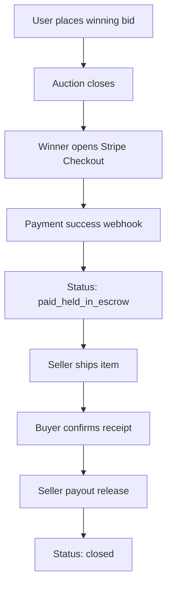
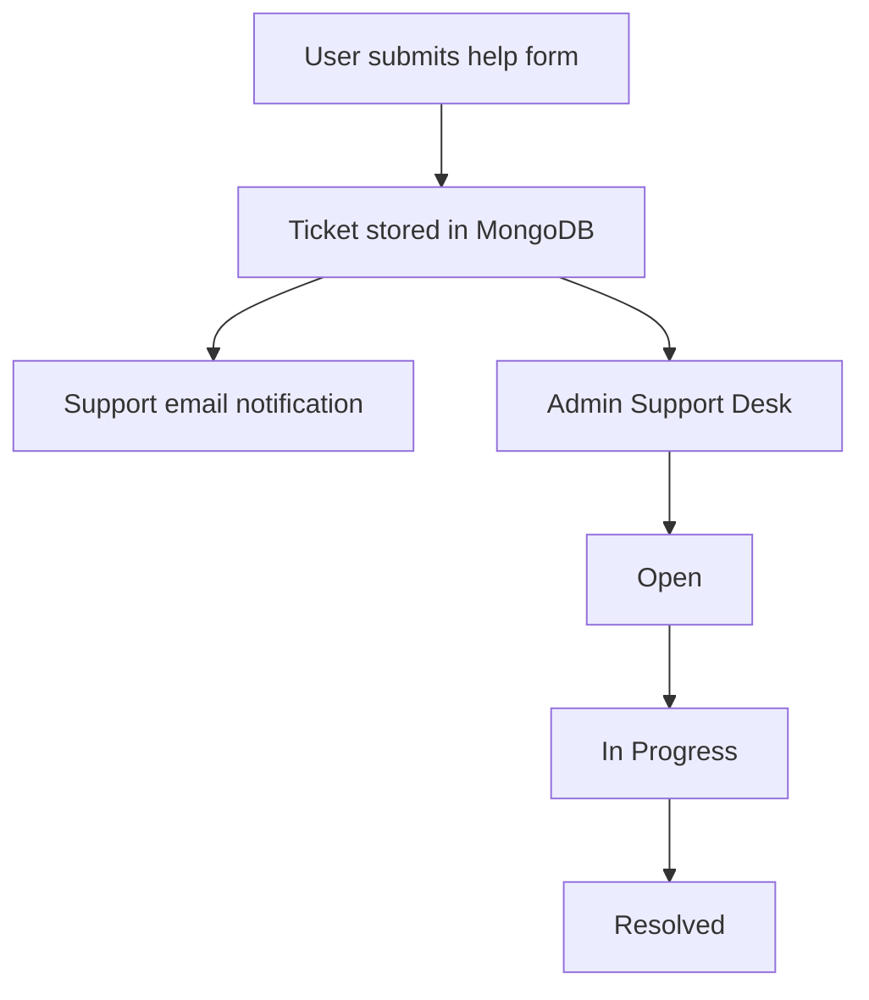

# BidPulse

BidPulse is a full-stack, real-time auction platform focused on secure transactions, responsive bidding, and admin-grade operational control.

Live app:
- Frontend (Vercel): https://bid-pulse.vercel.app
- Backend API (Render): https://bidpulse-qkd9.onrender.com

## 1. What Problem BidPulse Solves
Traditional online auction flows fail in three areas:
- Trust: buyers fear paying before delivery, sellers fear non-payment.
- Fairness: end-of-auction bid sniping creates unfair outcomes.
- Operations: weak moderation and support tooling create unresolved disputes.

BidPulse solves this with:
- Escrow-based checkout and payout release.
- Real-time anti-sniping bidding updates.
- Admin operations dashboard for users, auctions, support, and financial visibility.

## 2. Core Product Features

### Buyer
- Browse live auctions with watchlist support.
- Place real-time bids.
- Pay through Stripe checkout.
- Hold payment in escrow until item is received.
- Confirm receipt to release payout.

### Seller
- Create/manage auction listings.
- Track bids and outcomes.
- View shipping details after payment.
- Receive payout after buyer confirmation.

### Admin
- Platform-level financial stats and transaction summaries.
- User moderation (ban/unban/delete + history view).
- Global auction moderation (search/filter/delete).
- Support desk:
  - Ticket queue with status transitions.
  - Live chat monitoring and responses.
  - Test email trigger for SMTP health checks.

## 3. Advanced UX Additions
- Animated visual system (fade-up, float, pulse-glow, glass surfaces).
- Refreshed visual direction with branded gradients, custom typography, and atmospheric backgrounds.
- Upgraded home sections:
  - Spotlight auctions.
  - Personal watchlist.
  - Live auction stream.
- How-It-Works workflow cards with animated progression.
- Help Center now includes:
  - Ticket-based email support (backed by DB + mail notifications).
  - Real-time live chat over Socket.io.

## 4. Tech Stack
- Frontend: React + Vite + Redux Toolkit + Tailwind CSS + Socket.io client
- Backend: Node.js + Express + Socket.io + Node-cron
- Database: MongoDB Atlas + Mongoose
- Payments: Stripe
- Email: Nodemailer (SMTP/service-based transport)
- Deployment: Vercel (frontend), Render (backend)

## 5. System Architecture



## 6. ERD (Entity Relationship Diagram)



## 7. Key Workflow Diagrams

### 7.1 Auction + Payment + Escrow



### 7.2 Support Ticket Flow



## 8. Performance and Reliability Issues We Faced

### Issue A: Signup/Login felt slow
Root cause:
- SMTP email sends happened inline in request lifecycle.

Fix:
- Converted non-critical emails to async fire-and-log.
- API responses are no longer blocked by mail transport latency.

### Issue B: Emails not sending reliably
Root cause:
- Env naming mismatch (`EMAIL_USER` vs `EMAIL_USERNAME`, `EMAIL_PASS` vs `EMAIL_PASSWORD`).

Fix:
- Added fallback-compatible config resolution.
- Added reusable transporter singleton.
- Added startup transport verification log.
- Added admin "Send Test Email" control.

### Issue C: Production integration breaks (checkout/socket)
Root cause:
- Hardcoded local URLs and route mismatch.

Fix:
- Socket URL derived from env/API base.
- Payment route compatibility added.
- Frontend checkout endpoint corrected.

### Issue D: Admin endpoints degraded with scale
Root cause:
- Full collection scans and in-memory reductions.

Fix:
- Added indexes.
- Added aggregate-based stat computation.
- Added pagination-ready list patterns and lean reads.

## 9. Security and Operational Hardening
- Removed hardcoded admin credential fallback.
- Enforced banned-user login block.
- Added stricter CORS + compression.
- Added DB pool/timeouts and model indexes.

## 10. API Highlights

### Auth
- `POST /api/auth/register`
- `POST /api/auth/login`
- `POST /api/auth/forgotpassword`
- `PUT /api/auth/resetpassword/:resetToken`

### Auctions
- `GET /api/auctions?status=active&includeBids=false&page=1&limit=100`
- `GET /api/auctions/:id`
- `POST /api/auctions/:id/bid`

### Payment
- `POST /api/payment/checkout/:auctionId`
- `POST /api/payment/create-checkout-session/:auctionId` (compat alias)
- `POST /api/payment/release/:auctionId`
- `POST /api/webhook` (Stripe)

### Admin
- `GET /api/admin/stats`
- `GET /api/admin/users`
- `PUT /api/admin/users/ban/:id`
- `DELETE /api/admin/users/:id`
- `GET /api/admin/users/:id/history`
- `GET /api/admin/auctions`
- `DELETE /api/admin/auctions/:id`
- `POST /api/admin/test-email`

### Support
- `POST /api/support/tickets`
- `GET /api/support/tickets` (admin)
- `PUT /api/support/tickets/:id` (admin)

## 11. Environment Variables

### Backend (`backend/.env`)
```env
NODE_ENV=production
PORT=5000
MONGO_URI=...
JWT_SECRET=...
JWT_EXPIRE=30d

CLIENT_URL=https://bid-pulse.vercel.app
CORS_ORIGIN=https://bid-pulse.vercel.app
CORS_ORIGINS=https://bid-pulse.vercel.app

ADMIN_EMAIL=...
ADMIN_PASS=...
SUPPORT_EMAIL=...

# Email (either naming style works)
EMAIL_SERVICE=gmail
EMAIL_USERNAME=...
EMAIL_PASSWORD=...
# OR
EMAIL_USER=...
EMAIL_PASS=...

# Optional SMTP mode
SMTP_HOST=
SMTP_PORT=587
SMTP_SECURE=false

STRIPE_SECRET_KEY=...
STRIPE_WEBHOOK_SECRET=...

MONGO_MAX_POOL_SIZE=20
MONGO_SERVER_SELECTION_TIMEOUT_MS=10000
MONGO_SOCKET_TIMEOUT_MS=45000
```

### Frontend (`frontend/.env`)
```env
VITE_API_URL=https://bidpulse-qkd9.onrender.com/api
VITE_SOCKET_URL=https://bidpulse-qkd9.onrender.com
```

## 12. Local Development

```bash
# backend
cd backend
npm install
npm run dev

# frontend
cd ../frontend
npm install
npm run dev
```

Build frontend:
```bash
cd frontend
npm run build
```

## 13. Deployment Notes
- Render free-tier instances can sleep and cause first-request cold-start latency.
- Vercel environment should always point to the deployed API URL.
- Stripe webhook secret must match the exact deployed backend endpoint.
- Configure support/admin emails in Render env before running production traffic.

## 14. Current Admin Operating Checklist
- Monitor platform stats from Admin Dashboard.
- Moderate user behavior from Users panel.
- Remove suspicious listings from Auctions panel.
- Resolve customer issues from Support Desk.
- Trigger test email from Support Desk after env changes.

## 15. Future Roadmap
- Persist live support chat transcripts.
- Add role-based agent assignment for support tickets.
- Add elastic search for auctions/tickets.
- Add automated fraud/risk scoring.
- Add Web Push notifications for outbid + support updates.

## 16. License
MIT
